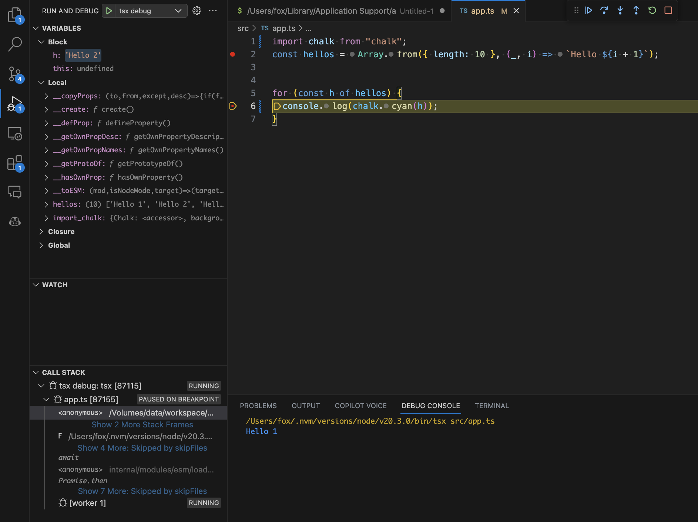
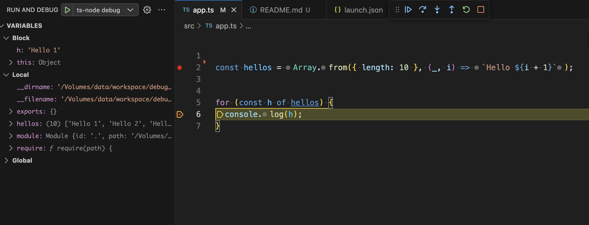

# In 2023, New Century TypeScript Debugging Methods

  ## `tsx` example
  - `npm i -g tsx`
  - add `.vscode/launch.json`
  ```json
  {
    "version": "0.2.0",
    "configurations": [
      {
        "name": "tsx debug",
        "type": "node",
        "request": "launch",
        "args": [
          "${relativeFile}"
        ],
        "runtimeExecutable": "tsx",
        "cwd": "${workspaceRoot}",
        "internalConsoleOptions": "openOnSessionStart"
      }
    ]
  }
  ```
  


<details>
  <summary markdown="span">`ts-node` example</summary>

  ## `ts-node` example

  - `npm i ts-node`
  - add `.vscode/launch.json`

  ```json
  {
    "version": "0.2.0",
    "configurations": [
      {
        "name": "ts-node debug",
        "type": "node",
        "request": "launch",
        "args": [
          "${relativeFile}"
        ],
        "runtimeArgs": [
          "-r",
          "ts-node/register"
        ],
        "cwd": "${workspaceRoot}",
        "internalConsoleOptions": "openOnSessionStart"
      }
    ]
  }
  ```
  

</details>

# enjoy typescript coding :)